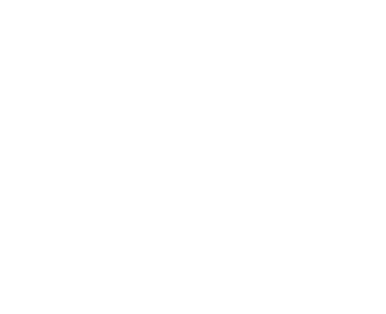
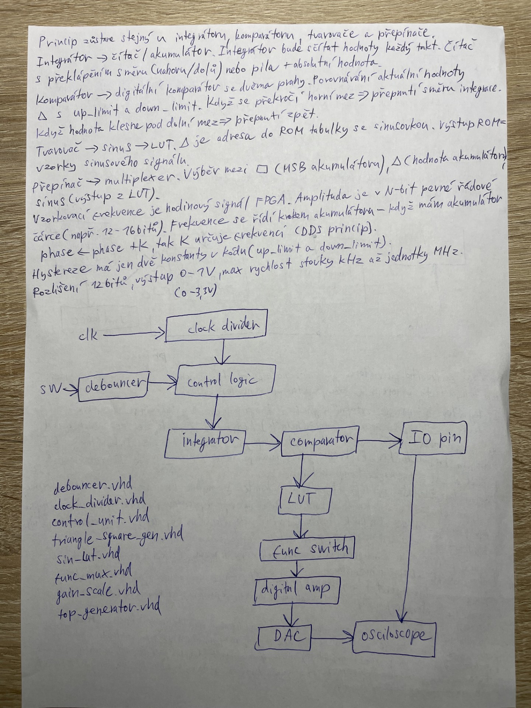

# DE1_Projekt_uloha2
## Úlohy:

# Hlavné bloky:
Clock divider – delenie hodinového signálu

Debouncer – ošetrenie tlačidiel (sw)

Control logic – riadenie výberu vlnového tvaru

Integrátor (čítač/akumulátor) – generuje obdĺźnik / trojuholník

Komparátor – s up_limit a down_limit, prepína smer integrácie

LUT – tabuľka pre sínus (DDS princíp)

Tune switch (MUX) – výber medzi obdĺžnikom, píla/trojuholník, sínus, riadenie cez 1 tlačítko na 3 režimi

Digital amp – digitálne zosilnenie

DAC – výstup na osciloskopu

## Rozdelenie úloh
## Dodatky

## Prepis
Funkční generátor WaveGen (WaveFrom Generator) umožňuje generovat harmonický, trojúhelníkový a obdélníkový signál. V moderním pojetí umí WaveGen generovat signál libovolného průběhu, kdy se jedná o programovatelný DDS (Direct Digital Synthesis) generátor.

Náš WaveGen (zkráceně WG) má následující architekturu: Clock Divider, Debouncer, Control Logic, Integrator, Comparator, IO pin, LUT, MUX, Digital Amplifier, DAC a Osciloscope.

Princip fungování celého designu je popsán v těchto bodech:

a)  Máme vstupní clk signál, který jde do Clock Divideru

Integrátor bude sčítat hodnoty každý takt.(?) Čítač s preklápanie smeru (nahoru/dolu) alebo pila + absolútna hodnota.

Komparátor -> digitálny komparátor s dvoma prahami

Porovnávanie aktuálnej hodnoty △ s up_limit a down_limit. 
Keď sa preskočí horná mez        => prepnutím smeru integrácie
Keď hodnota klesne pod dolnú mez => prepnutie späť

Tvarovač -> sinus -> LUT
△ je adresa do ROM tabulky so sínosovkou.
výstup ROM = vzorky sínusového signálu

Prepinač -> Multiplexor

Výber medzi ▢ (MSB akumulátor), △ (hodnota akumulátoru), sínus (výstup z LUT)

Vzorkovací frekvencia je hodinový signál FPGA. amplitúda je v N-bit pevne radová čiarke (napr. 12-16 bit). Frekvencia sa riadi krokom akumulátora - keď mám akumulátor phase <- phase + K, tak K urćuje frekvenciu (DDS princip). Hystereze má len dve konštanty v Kóde (up_limit a down_limit). Rozlíšenie 12 bitov, výstup 0-1V, max rychlosť stovky kHz až jednotky MHz

