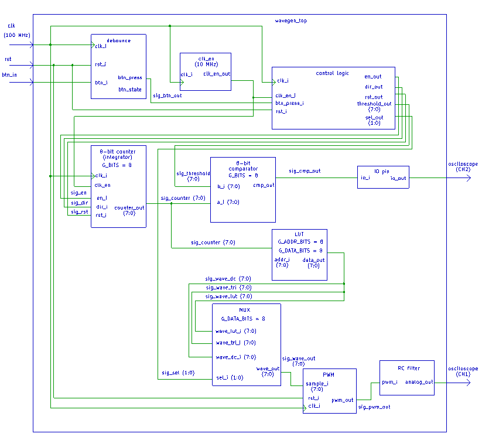

# DE1 Projekt – Generátor priebehov (úloha 2)
## Platforma: Nexys A7-50T | Jazyk: VHDL | Nástroj: Vivado

---

## Štruktúra projektu

```
DE1_Projekt_uloha2/
├── src/
│   ├── square_wave_gen.vhd   ← Generátor obdĺžnika 
│   ├── pwm_gen.vhd           ← 8-bit PWM modul 
│   ├── seg7_ctrl.vhd         ← Ovládač 7-seg displeja 
│   └── top.vhd               ← Vrchná entita 
├── sim/
│   └── tb_square_wave_gen.vhd ← Testbench pre square_wave_gen
└── constraints/
    └── nexys_a7_50t.xdc      ← Pin constraints
```

---

## Ovládanie na doske

| Vstup       | Funkcia                                                      |
|-------------|--------------------------------------------------------------|
| `SW[2:0]`   | Výber frekvencie (8 predvolieb)                              |
| `SW[4:3]`   | Výber priebehov (00=□, 01=∿, 10=⊿, 11=△) (EXPERIMENTÁLNE)   |
| `BTNC`      | Systémový reset                                              |

---

### Frekvenčné predvoľby (SW[2:0])

| SW[2:0] | Frekvencia | 7-seg displej |
|---------|------------|---------------|
| `000`   | 1 Hz       | `       1`    |
| `001`   | 2 Hz       | `       2`    |
| `010`   | 5 Hz       | `       5`    |
| `011`   | 10 Hz      | `      10`    |
| `100`   | 100 Hz     | `     100`    |
| `101`   | 1 kHz      | `    1000`    |
| `110`   | 10 kHz     | `   10000`    |
| `111`   | 100 kHz    | `  100000`    |

---

### LED indikátory

| LED     | Popis                              |
|---------|------------------------------------|
| `LED[0]`| Surový obdĺžnik (bliká pri 1–10 Hz)|
| `LED[1]`| Hz indikátor                       |
| `LED[2]`| kHz indikátor                      |
| `LED[6:5]`| Vybraný priebeh (SW[4:3])        |

---

## PWM výstup

**Pin:** `JA[0]` (Pmod JA, pin 1)

Pre analógový výstup pridaj RC dolnopriepustný filter:

```
JA[0] ──┤ R=1kΩ ├──┬── Výstup (osciloskop / DAC)
                   │
                 C=100nF
                   │
                  GND
```

---

## Bloková Schéma




