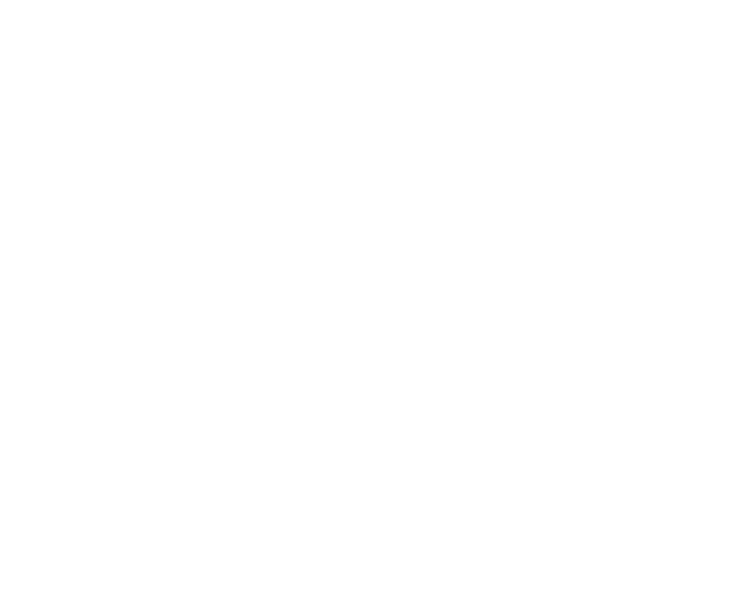

# DE1_Projekt_uloha2
## Dodatky

## Prepis
Princip zostane taký istý u integrátoru, komparátoru, tvrarovača a prepínača

Integrátor -> čítač/akumulátor

Integrátor bude sčítat hodnoty každý takt.(?) Čítač s preklápanie smeru (nahoru/dolu) alebo pila + absolútna hodnota.

Komparátor -> digitálny komparátor s dvoma prahami

Porovnávanie aktuálnej hodnoty △ s up_limit a down_limit. 
Keď sa preskočí horná mez        => prepnutím smeru integrácie
Keď hodnota klesne pod dolnú mez => prepnutie späť

Tvarovač -> sinus -> LUT
△ je adresa do ROM tabulky so sínosovkou.
výstup ROM = vzorky sínusového signálu

Prepinač -> Multiplexor

Výber medzi ▢ (MSB akumulátor), △ (hodnota akumulátoru), sínus (výstup z LUT)

Vzorkovací frekvencia je hodinový signál FPGA. amplitúda je v N-bit pevne radová čiarke (napr. 12-16 bit). Frekvencia sa riadi krokom akumulátora - keď mám akumulátor phase <- phase + K, tak K urćuje frekvenciu (DDS princip). Hystereze má len dve konštanty v Kóde (up_limit a down_limit). Rozlíšenie 12 bitov, výstup 0-1V, max rychlosť stovky kHz až jednotky MHz

