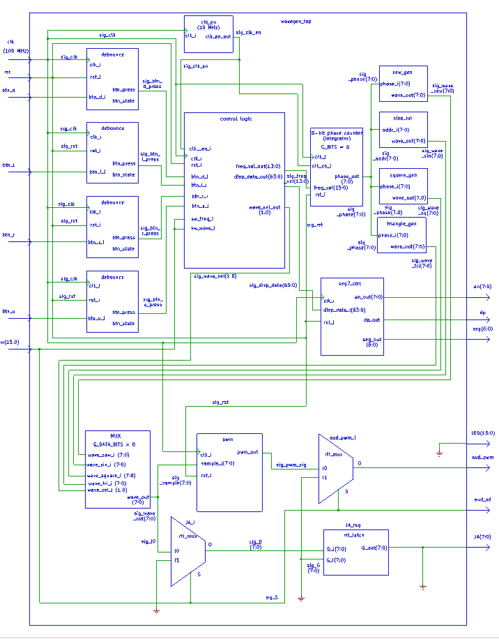

# DE1 Projekt – Generátor priebehov (úloha 2)
### Platforma: Nexys A7-50T | Jazyk: VHDL | Nástroj: Vivado

# Obsah:
### [Štruktúra projektu](https://github.com/qubbo1/DE1_Projekt_uloha2#%C5%A1trukt%C3%BAra-projektu-1)
### [Architecture Overview](https://github.com/qubbo1/DE1_Projekt_uloha2#architecture-overview-1)
### [Popis priebehov](https://github.com/qubbo1/DE1_Projekt_uloha2#popis-priebehov-1)
### [Ovladanie](https://github.com/qubbo1/DE1_Projekt_uloha2#ovladanie-1)
### [Simulácie](https://github.com/qubbo1/DE1_Projekt_uloha2#simul%C3%A1cie-1)
### [Blokové Schéma](https://github.com/qubbo1/DE1_Projekt_uloha2#blokov%C3%A1-sch%C3%A9ma)

---
## Štruktúra projektu

```
DE1_Projekt_uloha2/
├── src/
│   ├── square_wave_gen.vhd   ← Generátor obdĺžnika 
│   ├── pwm_gen.vhd           ← 8-bit PWM modul 
│   ├── seg7_ctrl.vhd         ← Ovládač 7-seg displeja 
│   └── top.vhd               ← Vrchná entita 
├── sim/
│   └── tb_square_wave_gen.vhd ← Testbench pre square_wave_gen
└── constraints/
    └── nexys_a7_50t.xdc      ← Pin constraints
```
##  Architecture Overview


# Komponenty Generátoru Průběhů (VHDL)

### Komponenta: `clk_en`
**Funkce:** Obecný generátor povolení hodin (clock-enable). Generuje jednocyklový pulz každých G_MAX hodinových cyklů. Výchozí G_MAX=1 000 000. Používá se pro ošetření zákmitů (debounce) s G_MAX=200 000 → vzorkování 2 ms při 100 MHz.

| Název signálu | Směr | Datový typ VHDL | Velikost vektoru | Popis signálu |
|---|---|---|---|---|
| `clk` | in | std_logic | - | 100 MHz systémové hodiny |
| `rst` | in | std_logic | - | Synchronní reset aktivní v úrovni High |
| `ce` | out | std_logic | - | Jednocyklový povolovací pulz |

---

### Komponenta: `debounce`
**Funkce:** Ošetření zákmitů tlačítek a detektor hran. Synchronizuje surový vstup, vzorkuje každé 2 ms přes clk_en, vyžaduje 4 po sobě jdoucí shodné vzorky. Výstupem je stabilní úroveň, jednocyklový pulz při stisku, jednocyklový pulz při uvolnění.

| Název signálu | Směr | Datový typ VHDL | Velikost vektoru | Popis signálu |
|---|---|---|---|---|
| `clk` | in | std_logic | - | 100 MHz systémové hodiny |
| `rst` | in | std_logic | - | Synchronní reset aktivní v úrovni High |
| `btn_in` | in | std_logic | - | Surový vstup tlačítka (se zákmity) |
| `btn_state` | out | std_logic | - | Stabilní úroveň (ošetřeno proti zákmitům) |
| `btn_press` | out | std_logic | - | Jednocyklový pulz při stisknutí (náběžná hrana) |
| `btn_release` | out | std_logic | - | Jednocyklový pulz při uvolnění (sestupná hrana) |

---

### Komponenta: `control_logic`
**Funkce:** Řadič menu. SW[0]=1,SW[1]=0 → režim frekvence: BTNU/BTND mění číslici na pozici kurzoru, BTNR/BTNL posunuje kurzor. SW[1]=1,SW[0]=0 → režim průběhu: BTNU/BTND přepíná průběh. Výstupem je binární frekvence (0–9999 Hz), 2bitový výběr průběhu a 64bitové slovo pro displej.

| Název signálu | Směr | Datový typ VHDL | Velikost vektoru | Popis signálu |
|---|---|---|---|---|
| `clk` | in | std_logic | - | 100 MHz systémové hodiny |
| `rst` | in | std_logic | - | Synchronní reset aktivní v úrovni High |
| `btn_u` | in | std_logic | - | Pulz tlačítka Nahoru (ošetřený) |
| `btn_d` | in | std_logic | - | Pulz tlačítka Dolů (ošetřený) |
| `btn_l` | in | std_logic | - | Pulz tlačítka Vlevo (ošetřený) |
| `btn_r` | in | std_logic | - | Pulz tlačítka Vpravo (ošetřený) |
| `sw_freq` | in | std_logic | - | SW[0] — režim úpravy frekvence |
| `sw_wave` | in | std_logic | - | SW[1] — režim výběru průběhu |
| `freq_val` | out | std_logic_vector | (13 downto 0) | Binární frekvence 0–9999 Hz |
| `wave_sel` | out | std_logic_vector | (1 downto 0) | Průběh: 00=SQ 01=SIN 10=SAW 11=TRI |
| `disp_data` | out | std_logic_vector | (63 downto 0) | 8×8bitové slovo displeje pro seg7_ctrl |

---

### Komponenta: `phase_counter`
**Funkce:** DDS fázový akumulátor. Každý hodinový cyklus přičte incr = freq_val × 43 do 32bitového registru. Horních 8 bitů = výstupní fáze. Přesnost: f_out ≈ freq_val × 1,001 Hz (chyba < 0,12 %). freq_val=0 → fáze zmrazena (DC).

| Název signálu | Směr | Datový typ VHDL | Velikost vektoru | Popis signálu |
|---|---|---|---|---|
| `clk` | in | std_logic | - | 100 MHz systémové hodiny |
| `rst` | in | std_logic | - | Synchronní reset — vynuluje akumulátor |
| `freq_val` | in | std_logic_vector | (13 downto 0) | Cílová frekvence v Hz (0–9999) |
| `phase` | out | std_logic_vector | (7 downto 0) | Aktuální fáze DDS 0–255 |

---

### Komponenta: `sine_lut`
**Funkce:** Asynchronní 256položková sinusová ROM. Hodnoty = round(127,5 + 127,5 × sin(2π×i/256)). Rozsah: 0x00 (záp. vrchol) … 0x80 (střed) … 0xFF (kladný vrchol). Výstup je platný ve stejném cyklu jako adresa.

| Název signálu | Směr | Datový typ VHDL | Velikost vektoru | Popis signálu |
|---|---|---|---|---|
| `addr` | in | std_logic_vector | (7 downto 0) | Fázová adresa 0–255 |
| `data_out` | out | std_logic_vector | (7 downto 0) | Amplituda sinusu při dané fázi |

---

### Komponenta: `square_gen`
**Funkce:** Kombinační obdélníkový průběh se střídou 50 %. phase[7]='1' → 0xFF; phase[7]='0' → 0x00. Nepotřebuje hodiny ani reset.

| Název signálu | Směr | Datový typ VHDL | Velikost vektoru | Popis signálu |
|---|---|---|---|---|
| `phase` | in | std_logic_vector | (7 downto 0) | Vstup fáze z phase_counter |
| `wave_out` | out | std_logic_vector | (7 downto 0) | 0xFF (horní polovina) nebo 0x00 (dolní polovina) |

---

### Komponenta: `sawtooth_gen`
**Funkce:** Kombinační rostoucí pilovitý průběh. Výstup = přímo fáze (lineární náběh 0→255, okamžitý reset). Nepotřebuje hodiny ani reset.

| Název signálu | Směr | Datový typ VHDL | Velikost vektoru | Popis signálu |
|---|---|---|---|---|
| `phase` | in | std_logic_vector | (7 downto 0) | Vstup fáze 0–255 |
| `wave_out` | out | std_logic_vector | (7 downto 0) | Amplituda pily = fáze |

---

### Komponenta: `triangle_gen`
**Funkce:** Kombinační trojúhelníkový průběh. phase[7]='0' → výstup roste 0→254; phase[7]='1' → výstup klesá 254→0. Symetrický, bez ostrých hran. Nepotřebuje hodiny ani reset.

| Název signálu | Směr | Datový typ VHDL | Velikost vektoru | Popis signálu |
|---|---|---|---|---|
| `phase` | in | std_logic_vector | (7 downto 0) | Vstup fáze z phase_counter |
| `wave_out` | out | std_logic_vector | (7 downto 0) | Amplituda trojúhelníku 0x00–0xFE–0x00 |

---

### Komponenta: `wave_mux`
**Funkce:** Kombinační multiplexor 4 na 1. Vybírá jeden 8bitový vzorek průběhu na základě wave_sel. Výchozí (others) → obdélník.

| Název signálu | Směr | Datový typ VHDL | Velikost vektoru | Popis signálu |
|---|---|---|---|---|
| `wave_sq` | in | std_logic_vector | (7 downto 0) | Vzorek obdélníkového průběhu |
| `wave_sin` | in | std_logic_vector | (7 downto 0) | Vzorek sinusového průběhu |
| `wave_saw` | in | std_logic_vector | (7 downto 0) | Vzorek pilovitého průběhu |
| `wave_tri` | in | std_logic_vector | (7 downto 0) | Vzorek trojúhelníkového průběhu |
| `wave_sel` | in | std_logic_vector | (1 downto 0) | 00=SQ  01=SIN  10=SAW  11=TRI |
| `wave_out` | out | std_logic_vector | (7 downto 0) | Výstup zvoleného průběhu |

---

### Komponenta: `pwm`
**Funkce:** 8bitová PWM na frekvenci ≈390 kHz (100 MHz÷256). Čítač cykluje 0–255 každou periodu; výstup je HIGH, dokud je čítač < vzorek. Budí RC dolní propust → analogový průběh na konektoru AUX.

| Název signálu | Směr | Datový typ VHDL | Velikost vektoru | Popis signálu |
|---|---|---|---|---|
| `clk` | in | std_logic | - | 100 MHz systémové hodiny |
| `rst` | in | std_logic | - | Synchronní reset aktivní v úrovni High |
| `sample` | in | std_logic_vector | (7 downto 0) | Střída: 0x00=0%  0x80=50%  0xFF≈100% |
| `pwm_out` | out | std_logic | - | Výstupní PWM signál (~390 kHz) |

---

### Komponenta: `seg7_ctrl`
**Funkce:** Časově multiplexovaný řadič pro 8místný 7segmentový displej. Přepíná číslice každou 1 ms (100 000 cyklů) → obnova ~125 Hz na číslici. Formát bajtu: bit[7]=DP, bity[6:0]=segmenty (aktivní v úrovni LOW). Bajt 0=AN0 (zcela vpravo).

| Název signálu | Směr | Datový typ VHDL | Velikost vektoru | Popis signálu |
|---|---|---|---|---|
| `clk` | in | std_logic | - | 100 MHz systémové hodiny |
| `rst` | in | std_logic | - | Synchronní reset aktivní v úrovni High |
| `disp_data` | in | std_logic_vector | (63 downto 0) | 8×8bitová data displeje (bajt 0=AN0) |
| `seg` | out | std_logic_vector | (6 downto 0) | {CG,CF,CE,CD,CC,CB,CA} aktivní v úrovni LOW |
| `dp` | out | std_logic | - | Desetinná tečka, aktivní v úrovni LOW |
| `an` | out | std_logic_vector | (7 downto 0) | Povolení anod, aktivní vždy jedna v úrovni LOW |

---

### Komponenta: `top (wavegen_top)`
**Funkce:** Strukturní entita nejvyšší úrovně (Nexys A7-50T). Propojuje všechny podkomponenty. BTNC=reset. SW[0]/SW[1]=režim řízení. SW[2]=povolení AUX+JA. LED udržovány na '0'. AUD_PWM→RC→3,5mm jack. JA[0]=nejvyšší bit průběhu pro osciloskop.

| Název signálu | Směr | Datový typ VHDL | Velikost vektoru | Popis signálu |
|---|---|---|---|---|
| `CLK100MHZ` | in | std_logic | - | 100 MHz oscilátor desky |
| `BTNC` | in | std_logic | - | Střední tlačítko → reset systému |
| `BTNU` | in | std_logic | - | Tlačítko Nahoru |
| `BTND` | in | std_logic | - | Tlačítko Dolů |
| `BTNL` | in | std_logic | - | Tlačítko Vlevo |
| `BTNR` | in | std_logic | - | Tlačítko Vpravo |
| `SW` | in | std_logic_vector | (15 downto 0) | Přepínače: [0]=frekv [1]=průběh [2]=AUX pov. |
| `LED` | out | std_logic_vector | (15 downto 0) | LED diody — nevyužito, trvale na '0' |
| `SEG` | out | std_logic_vector | (6 downto 0) | Segmenty 7seg displeje (aktivní v úrovni LOW) |
| `DP` | out | std_logic | - | Desetinná tečka (aktivní v úrovni LOW) |
| `AN` | out | std_logic_vector | (7 downto 0) | Anody 7seg displeje (aktivní v úrovni LOW) |
| `AUD_PWM` | out | std_logic | - | PWM audio do AUX jacku (uzavíráno SW[2]) |
| `AUD_SD` | out | std_logic | - | Povolení audio zesilovače = SW[2] |
| `JA` | out | std_logic_vector | (7 downto 0) | Pmod: JA[0]=nejvyšší bit průběhu (SW[2]), zbytek '0' |

---


## Popis priebehov
| `wave_sel` | Skratka | Typ priebahu | Súbor / Popis |
|:----------:|---------|--------------|---------------|
| `00` | **SQr** | Square – obdĺžnikový | `square_gen.vhd` – 50 % duty cycle, skok 0 ↔ 255 |
| `01` | **SIn** | Sine – sínusový | `sine_lut.vhd` – 256-položková LUT, plná sínusoida |
| `10` | **SAu** | Sawtooth – pílový | `sawtooth_gen.vhd` – lineárny nábeh 0 → 255, potom skok na 0 |
| `11` | **trI** | Triangle – trojuholníkový | `triangle_gen.vhd` – nábeh 0 → 255 a späť 255 → 0 |

## Ovladanie
| Vstup       | Podmienka   | Funkcia                          |
|-------------|-------------|----------------------------------|
| `BTNU` ↑   | `SW(0)=1`   | Zvýšiť frekvenciu                |
| `BTND` ↓   | `SW(0)=1`   | Znížiť frekvenciu                |
| `BTNR` →   | `SW(1)=1`   | Ďalší vlnový tvar                |
| `BTNL` ←   | `SW(1)=1`   | Predchádzajúci vlnový tvar       |
| `BTNC`      | –           | Systémový reset                  |
| `SW(2)`     | –           | Povolenie AUX výstupu            |

## Simulácie

Simulace ukazuje funkci komponenty **multiplexor 4 na 1** (`wave_mux`). Dvoubitový řídicí signál (`wave_sel`) řídí výběr průběhu, který se následně zobrazí na osmibitovém výstupu.

* Když `wave_sel` = **`00`**, výstup je `wave_sq` (`00010001`).
* Když `wave_sel` = **`01`**, výstup je `wave_sin` (`00100010`).
* Když `wave_sel` = **`10`**, výstup je `wave_saw` (`00110011`).
* Když `wave_sel` = **`11`**, výstup je `wave_tri` (`01000100`).


<br>
<br>

Simulace ukazuje funkci komponenty **generátor PWM (pulzně šířkové modulace)**. Vnitřní 8bitový čítač (`cnt`) plynule inkrementuje a jeho hodnota se porovnává s 8bitovým vstupem (`sample`), čímž se řídí střída (duty cycle) výstupního signálu (`pwm_out`):

* Když `sample` = **`00000000`** (0 %), výstup `pwm_out` zůstává trvale v logické `0`.
* Když `sample` = **`10000000`** (odpovídá 50 %), výstup `pwm_out` má střídu 50 % (polovinu času `1`, polovinu `0`).
* Když `sample` = **`11001000`** (odpovídá cca 78 %), výstup `pwm_out` generuje úměrně širší impulz.
* Když `sample` = **`11111111`** (odpovídá cca 100 %), výstup `pwm_out` zůstává téměř po celou periodu v logické `1`.


<br>
<br>

Simulace ukazuje funkci komponenty **control logic (uživatelského rozhraní)**. Tato komponenta reaguje na stav přepínačů a stisky tlačítek pro úpravu nastavení:

* **Režim nastavení frekvence:** Pokud přepínač `sw_freq` = `1`, stisk tlačítek (`btn_u`, `btn_r`) postupně zvyšuje hodnotu frekvence (`freq_val`). Současně se odpovídajícím způsobem aktualizují výstupní data pro displej (`disp_data`).
* **Režim výběru typu vlny:** Je-li aktivován přepínač `sw_wave` = `1`, každé stisknutí tlačítka `btn_u` ovládá dvoubitový řídicí signál (`wave_sel`). Ten tak postupně prochází přes všechny své stavy (`00` → `01` → `10` → `11` → `00`).


<br>
<br>

Simulace ukazuje funkci komponenty **řadiče 7segmentového displeje**. Modul zpracovává 64bitový datový vstup `disp_data` (který typicky obsahuje data pro 8 číslic, 8 bitů na číslici) a generuje výstupní signály pro multiplexní řízení fyzického displeje:

* Po počátečním resetu (signál `rst` přejde z `1` do logické `0`) modul začne zpracovávat vstupní hodnoty.
* Signál `an[7:0]` (výběr anody) je nastaven na hodnotu `11111110`, což indikuje, že je aktuálně aktivována nultá (první) číslice displeje (anody jsou spínány logickou `0`).
* Výstupy `seg[6:0]` (řízení sedmi segmentů) a `dp` (desetinná tečka) se nastavují na základě příslušné části vstupního 64bitového slova `disp_data`. 
* Rozbalené struktury na dalších snímcích (např. u signálu `disp_data`) slouží pouze k detailnějšímu náhledu na jednotlivé bity uvnitř vektoru. V zobrazeném časovém okně nevykazuje výběr anody (`an`) změnu, což ukazuje ustálený stav pro zobrazení jedné konkrétní číslice.


<br>
<br>

Simulace ukazuje funkci komponenty **generátor pilovitého průběhu (sawtooth)**. Tento modul vytváří výstupní signál na základě přímé závislosti na vstupní fázi.

* Osmibitový výstupní signál `wave_out` po celou dobu přesně kopíruje hodnotu vstupního signálu `phase`.
* V první části simulace fáze skokově nabývá hodnot `00000000`, následně `01111111` a poté `11111111`.
* V druhé části časové osy (přibližně od času 29,000,000) začne hodnota rychle a plynule růst. 
* Rozbalený detail signálu `wave_out` jasně ukazuje, že jednotlivé bity (`[0]` až `[7]`) fungují jako klasický binární čítač. Nejnižší bit (`[0]`) přepíná nejrychleji, zatímco vyšší bity úměrně pomaleji, což ve výsledku reprezentuje lineárně rostoucí (pilovitou) hodnotu.


<br>
<br>

Simulace ukazuje funkci komponenty **generátor sinusového průběhu (sine wave ROM/LUT)**. Tento modul funguje jako vyhledávací tabulka, která převádí vstupní fázi na hodnotu amplitudy.

* Modul zpracovává osmibitový vstup `addr` (reprezentující fázi) a na výstup `data_out` posílá odpovídající předpočítanou osmibitovou hodnotu.
* V první části simulace jsou jasně vidět klíčové body sinusovky: při počáteční adrese `00000000` je výstup přesně v polovině rozsahu (`10000000`), při adrese `01000000` (čtvrtina periody) dosahuje výstup maxima (`11111111`), při `10000000` (polovina periody) se vrací do středu (`10000000`) a při `11000000` (tři čtvrtiny periody) nabývá minima (`00000000`).
* V druhé části časové osy (přibližně od času 36,000,000) začne adresa plynule růst, což na rozbalených bitech signálu `data_out` generuje plynulou digitální reprezentaci celého sinusového průběhu.


<br>
<br>

Simulace ukazuje funkci komponenty **generátor obdélníkového průběhu (square wave)**. Tento modul generuje dvoustavový výstupní signál vyhodnocením nejvyššího bitu (MSB) vstupní fáze.

* Osmibitový výstupní signál `wave_out` nabývá pouze dvou krajních hodnot (`00000000` nebo `11111111`) v přímé závislosti na hodnotě vstupního signálu `phase`.
* V první části simulace je zřejmé, že pokud je hodnota fáze v první polovině svého rozsahu (např. `00000000` a `01111111`), výstup zůstává na minimu (`00000000`). Při dosažení a překročení poloviny rozsahu (hodnoty `10000000` a `11111111`) se výstup skokově mění na maximum (`11111111`).
* V dynamické části na konci časové osy (přibližně od času 38,000,000), kdy se hodnota fáze začne plynule inkrementovat jako čítač, rozbalený detail signálu `phase` potvrzuje princip fungování. Přepínání celého výstupního signálu `wave_out` přesně kopíruje stav nejvyššího bitu fáze (`[7]`), což ve výsledku tvoří čistý obdélníkový průběh.


<br>
<br>

Simulace ukazuje funkci komponenty **generátor trojúhelníkového průběhu (triangle wave)**. Tento modul vytváří symetrický signál, který v první polovině periody lineárně roste a ve druhé polovině lineárně klesá.

* Modul využívá pomocný 7bitový vnitřní signál `lower7`, který obsahuje spodních 7 bitů vstupní fáze.
* V první polovině rozsahu fáze (když je nejvyšší bit fáze `0`, například při hodnotách `00000000` až `01111111`) hodnota výstupního signálu `wave_out` úměrně roste od nuly až k maximu.
* Jakmile fáze překročí polovinu svého rozsahu (nejvyšší bit se změní na `1`, například při `10000000`), směr se obrátí a výstupní signál `wave_out` začne z hodnoty maxima (`11111111`) opět postupně klesat.
* V pravé části časové osy, kde je fáze plynule inkrementována, ukazuje rozbalený detail signálu `wave_out` jasný obrat směru čítání. Jednotlivé bity (`[0]` až `[7]`) přestanou růst jako standardní binární čítač a začnou se přepínat v opačném pořadí, čímž formují sestupnou hranu trojúhelníkového signálu.


<br>
<br>

Simulace ukazuje funkci komponenty **BCD čítač**. Tento modul slouží k cyklickému počítání od nuly do devíti a často se využívá jako základ pro generování časových základen nebo multiplexování displeje.

* Na začátku časové osy je zachycen aktivní signál reset (`rst = 1`), který bezpečně drží hodnotu čítače `cnt` na výchozí nule.
* Jakmile reset klesne do neaktivní úrovně (`rst = 0`), začne sběrnice `cnt` s každým hodinovým taktem `clk` synchronně inkrementovat svou hodnotu.
* Průběh zřetelně ukazuje počítání v binárním formátu (zobrazeno bez úvodních nul) postupně od `1` přes `10`, `11` až po `1001`, což odpovídá dekadické hodnotě 9.
* Po dosažení hraniční hodnoty `1001` nepokračuje čítač na 10, ale v následujícím hodinovém taktu se automaticky vynuluje zpět na `0` a celý cyklus se opakuje. Rozbalené bity `[0]` až `[3]` ve spodní části detailně vizualizují přepínání jednotlivých signálů během tohoto zkráceného cyklu.


## Bloková Schéma




